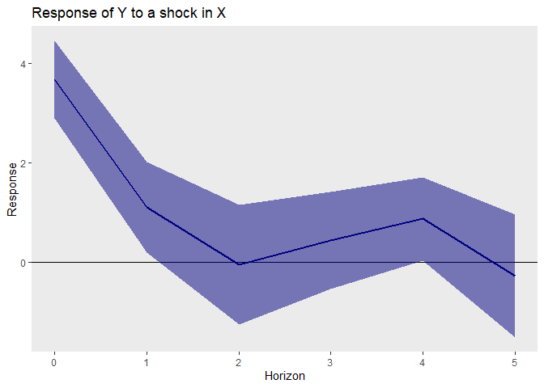

<!-- README.md is generated from README.Rmd. Please edit that file -->

# desla: Desparsified Lasso inference for Time Series

<!-- badges: start -->

[](https://cran.r-project.org/package=desla)
[](https://cran.r-project.org/package=desla)
<!-- badges: end -->

## Installation

### CRAN

The easiest way to install the package from CRAN is with the command:

``` r
install.packages("desla")
```

### GitHub

Working versions of updates to the package are available on GitHub.
These can be installed easily with the devtools package:

``` r
install.packages("devtools")
```

You can then install the desla package from the GitHub depository
directly by running:

``` r
devtools::install_github("RobertAdamek/desla")
```

## Load Package

After installation, the package can be loaded in the standard way:

``` r
library(desla)
```

## Usage

The following toy example demonstrates how to use the functions. Let’s
first simulate some data:

``` r
set.seed(312)
X<-matrix(rnorm(100*100), nrow=100)
y<-X[,1:4] %*% c(1, 2, 3, 4) + rnorm(100)
```

### The function `desla`

The `desla()` function provides inference on parameters of the linear
regression model of `y` on `X`, using the desparsified lasso as detailed
in Adamek et al. (2022a). First, we specify the indices of variables for
which confidence intervals are required via the argument `H`. The
`desla()` function then simply takes the response `y`, the predictor
matrix `X` and the set of indices `H` as input. Its output is an object
of class `desla`, that can be used to conduct inference on the desired
set of parameters.

``` r
H<-1:3
d<-desla(X=X, y=y, H=H)
```

The function `summary()` provides a quick way to view the main results:

``` r
summary(d)
#> 
#> Call:
#> desla(X = X, y = y, H = H)
#> 
#> 
#> Coefficients:
#>    Estimate Std. Error t value Pr(>|t|)    
#> X1   1.0769     0.1284   8.385   <2e-16 ***
#> X2   1.9760     0.1367  14.457   <2e-16 ***
#> X3   2.9460     0.1306  22.555   <2e-16 ***
#> ---
#> Signif. codes:  0 '***' 0.001 '**' 0.01 '*' 0.05 '.' 0.1 ' ' 1
#> 
#> Selected lambdas:
#>                           
#> Initial regression 0.06529
#> X1                 0.29314
#> X2                 0.28772
#> X3                 0.28772
#> 
#> Selected variables:
#>                                  
#> Initial regression X1, X2, X3, X4
#> X1                           none
#> X2                           none
#> X3                           none
```

The point estimates are accessible via the output slot `bhat` or the
`coef()` function. Confidence intervals can be accessed via the output
slot `intervals` or the `confint()` function. For optional arguments and
other details, see the function documentation with the command `?desla`.

### The function `HDLP()`

The second key function of the package is the `HDLP()` function which
implements the high-dimensional local projections detailed in Adamek et
al. (2022b). As an example, consider the response of `y` to a shock in
the fourth predictor variable, and imagine that: \* We classify the
first three predictor variables as “slow moving” and enter the equation
contemporaneously (ordered before the fourth variable); \* The 5th up to
10th variables are classified as “fast moving” and only enter with a lag
(thus ordered after the fourth variable). Then the follow lines of code
obtain the impulse responses with two lags included, up to a maximum
horizon of 5. By applying the plot function to the output of the HDLP
function, the corresponding impulse response function can be visualized.

``` r
h<-HDLP(x=X[,4], y=y, q=X[,1:3], r = X[,6:10], hmax=5, lags=2)
plot(h)
```

<!-- -->

The function also implements the state-based local projections of Ramey
& Zubairy (2018) with the optional `state_variables` argument. State
variables can be created in two ways:

-   A matrix with dummy variables, where each column indicates a 1 (or
    `TRUE`) for the observations belonig to that state:

``` r
s_dummies <- matrix(c(rep(1, 50), rep(0, 100), rep(1, 50)), ncol=2, 
                    dimnames = list(NULL, c("A","B")))
```

-   A categorical variable (factor) where each entry indicates the state
    of the corresponding observation. This is particularly useful in the
    case of multiple state variables (which can be combined in a data
    frame), as the function then automatically creates the states as
    interactions between them.

``` r
# Factor corresponding to s_dummies above
s_factor <- factor(c(rep("A", 50), rep("B", 50)), levels = c("A","B"))
# A second state variable
a_second_factor <- factor(c(rep("C", 25), rep("D", 50), rep("C", 25)), levels = c("C","D"))
s_twofactors <- data.frame(S1 = s_factor, S2 = a_second_factor)
```

Both options work with the same syntax in `HDLP()`. In case of doubt, a
user can consult the function `create_state_dummies()` - which is also
used internally in `HDLP()` - to check if the states are created as
desired.

We show it here for the first option. Two separate impulse response
functions are obtained for the response of `y` to a shock in the fourth
predictor: one for state `A` and one for state `B`.

``` r
h_s <- HDLP(x=X[,4], y=y, q=X[,1:3], r=X[,6:10], state_variables=s_dummies, hmax=5, lags=2)
plot(h_s)
```

<!-- -->

For other optional arguments and details, see the function documentation
with the command `?HDLP`.

## References

Adamek, R., S. Smeekes, and I. Wilms (2022a). Lasso inference for
high-dimensional time series. *Journal of Econometrics*, Forthcoming.

Adamek, R., S. Smeekes, and I. Wilms (2022b). Local Projection inference
in High Dimensions. arXiv e-print 2209.03218.

Ramey, V. A. and S. Zubairy (2018). Government spending multipliers in
good times and in bad: evidence from US historical data. *Journal of
Political Economy 126*, 850–901.
